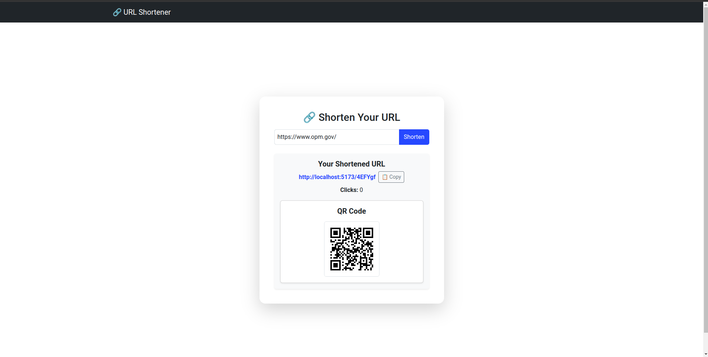

# URL Shortener

## 📌 Project Overview



**Preview : https://url-short-a.vercel.app/**

This project is a **URL Shortener** built with **Node.js**, **Express**, and **MongoDB**. It allows users to:

- Shorten long URLs
- Redirect short URLs to their original destinations
- Track the number of times a short URL has been accessed
- Generate QR codes for shortened URLs
- View API documentation using **Swagger**

## 🛠 Tech Stack

- **Node.js** (Backend)
- **React.js** (Frontend)
- **Express.js** (Web Framework)
- **MongoDB** (Database)
- **Mongoose** (ODM for MongoDB)
- **NanoID** (Unique ID generator)
- **QR Code Generator**
- **Swagger** (API Documentation)

---

## 📁 Project Structure

```
backend
├── app.js
├── babel.config.json
├── config
│   └── swagger.js
├── controllers
│   └── urlController.js
├── jest.config.js
├── models
│   └── UrlSchema.js
├── package.json
├── package-lock.json
├── routes
│   └── index.js
├── services
│   └── urlServices.js
├── tests
│   ├── e2e
│   │   ├── generateQrCode.e2e.test.js
│   │   ├── redirectToOriginalUrl.e2e.test.js
│   │   └── shortenUrl.e2e.test.js
│   └── unit
│       ├── generateQrCode.test.js
│       ├── redirectToOriginalUrl.test.js
│       └── shortenUrl.test.js
├── utils
│   ├── generateUniqueId.js
│   └── validateUrl.js
└── vercel.json
```

```
client
├── eslint.config.js
├── index.html
├── package.json
├── package-lock.json
├── public
│   └── url-link-svgrepo-com.svg
├── README.md
├── src
│   ├── api
│   │   └── api.js
│   ├── App.css
│   ├── App.jsx
│   ├── assets
│   ├── components
│   │   ├── QrCode.jsx
│   │   └── ShortenForm.jsx
│   ├── index.css
│   ├── main.jsx
│   └── pages
│       ├── Home.jsx
│       └── Redirect.jsx
├── vercel.json
└── vite.config.js
```

---

## 🚀 Setup Instructions

# Backend

### 1️⃣ Install Dependencies

Ensure **Node.js** is installed, then run:

```sh
npm install
```

### 2️⃣ Configure Environment Variables

Create a **.env** file in the root directory and add the following:

```
MONGO_URI=your_mongodb_connection_string
PORT=3000
CLIENT_PORT=http://localhost:5173
NODE_ENV=development
```

### 3️⃣ Start the Application

Run in **development mode**:

```sh
npm run dev
```

Run in **production mode**:

```sh
npm start
```

### 4️⃣ API Documentation

You can access **Swagger API documentation** at:

```
http://localhost:3000/api-docs
```

### 5️⃣ Running Tests

To run all tests:

```sh
npm test
```

---

## 🌐 API Endpoints

### 🔹 Shorten URL

**POST** `/shorten`

- Request Body:
  ```json
  {
    "longUrl": "https://example.com"
  }
  ```
- Response:
  ```json
  {
    "shortUrl": "http://localhost:3000/abc123",
    "clicks": 0
  }
  ```

### 🔹 Redirect to Original URL

**GET** `/:urlId`

- Example: `GET /abc123`
- Redirects to the original URL

### 🔹 Generate QR Code for Short URL

**GET** `/qr/:urlId`

- Example: `GET /qr/abc123`
- Response:
  ```json
  {
    "url": "data:image/png;base64,..."
  }
  ```

# Frontend

### 1️⃣ Install Dependencies

```sh
npm install
```

### 2️⃣ Configure API_BASE_URL

Adjust the base url in the **./api/api.js** file

```code
const API_BASE_URL = "http://localhost:3000";
```

### 3️⃣ Start the Application

Run in **development mode**:

```sh
npm run build:dev
```

Run in **production mode**:

```sh
npm rund build:prod
```

---

## 🎯 Features

✅ Shorten any valid URL
✅ Redirect short URLs to original links
✅ Track number of visits per short URL
✅ Generate QR codes for short URLs
✅ REST API with Swagger documentation
✅ Unit testing with Jest
